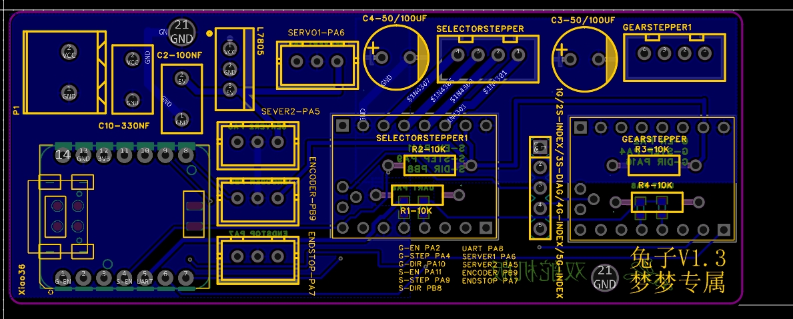
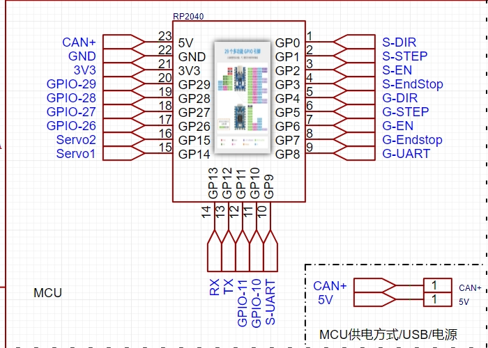
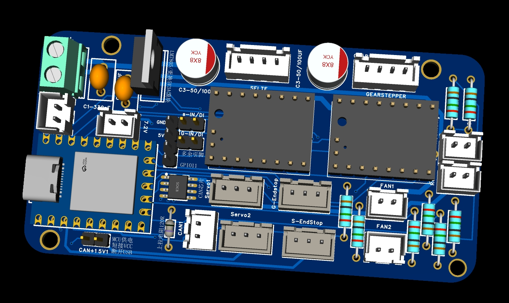
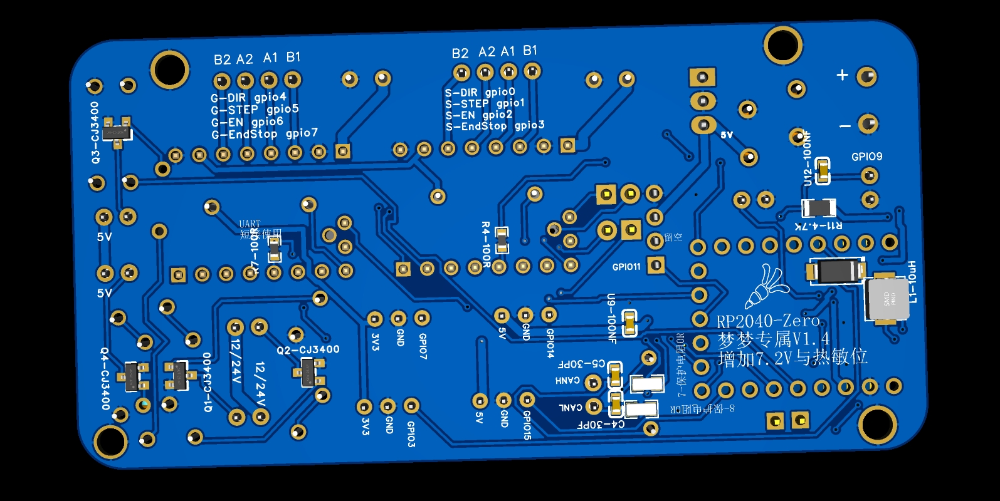
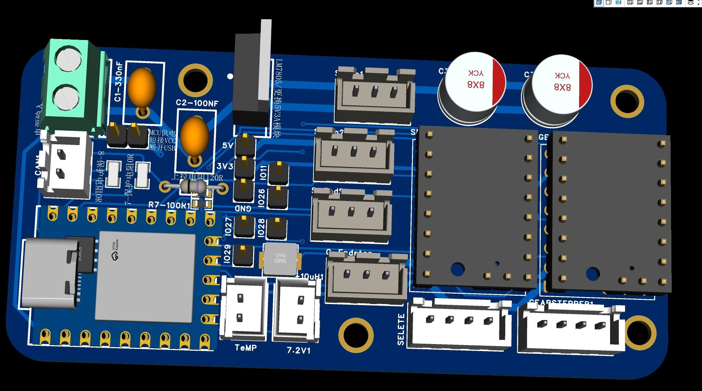
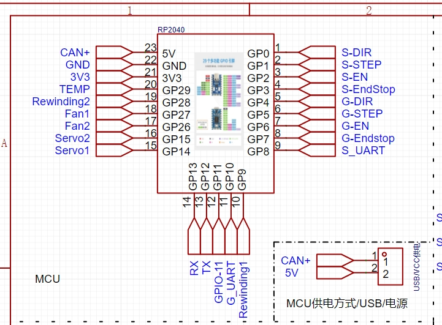
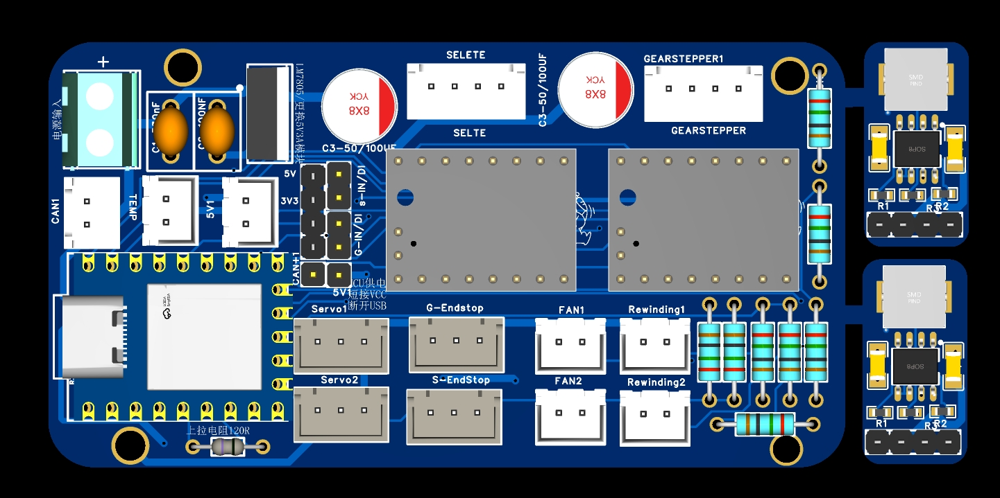
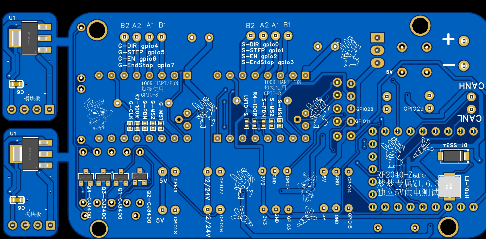
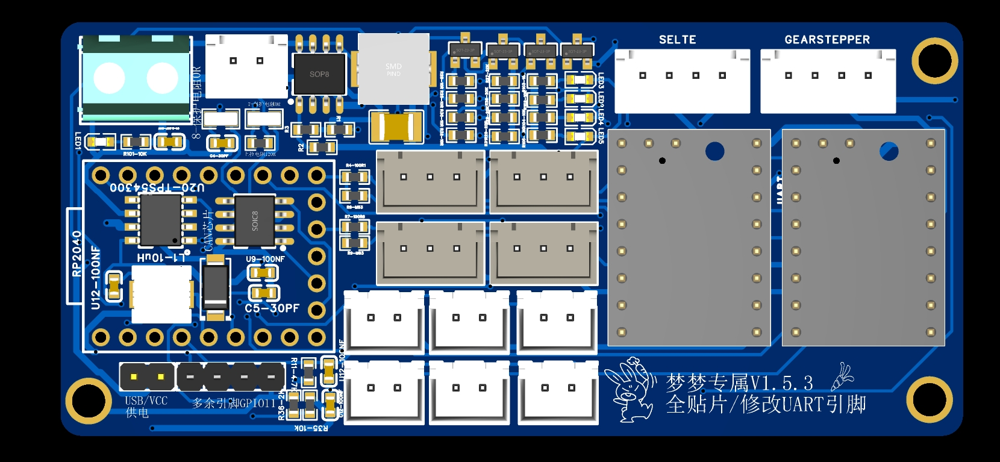
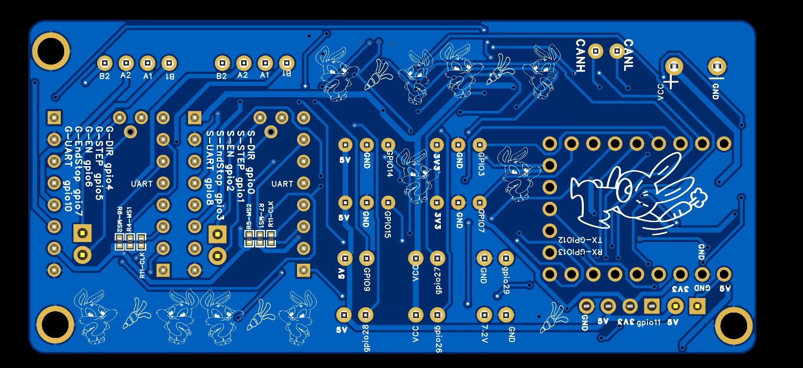

<!--
 * @Author: Mjf
 * @Date: 2023-09-16 18:54:57
 * @LastEditTime: 2024-05-12 13:33:59
 * @LastEditors: Win_VScode
 * @Description: 
 * @FilePath: \undefinedf:\download\TradRack_Beta-main\STLs\TradRack_Beta-main-mod\TradRack_Beta-main-mod\兔子板可打板\readme.md
 * 版权声明暂无
-->
### 梦梦专属兔子板V1.3
**原版xiao已做验证可正常使用，RP2040主板已验证**  

算了我补下零件清单吧
> 1、XH2.54  3-4P 插座（2040需要买点2P的）  
2、2P，7P-8P引脚（2.54单排母-2040需要9P跟5P的）  
3、独石电容0.33UF，0.1UF   
4、KF127-5.08 2P直插（电源输入-觉得不方便的自己换）  
5、10K色环电阻 其实每张板子就用4个（2040需要其它电阻的，另外就是0R贴片自己换导线）  
6、L7805CV电源转换（可换成5V1A或是5V3A模块不值钱自己换）  
7、直插电解电容25V100UF（白菜价）  
8、UART跟保护电阻啥的买个锤子直接烙铁焊接完事  
9、120欧 色环电阻（can板保护电路-2040专用）  
10、0欧贴片保护电阻（买个锤子-2040专用）  
11、100NF贴片电容（保护作用不要没啥事-2040专用）  
12、30PF贴片电容（保护作用不要没啥事-2040专用）  
13、CJ3400 SOT-23 场效应管  （4个扩展电路使用-2040专用）  
14、主控Seeduino Xiao  35一个随便买、RP2040-zero 超过15不要买  
15、单排排针买40个绝对用不完  

*xiao-兔子板引脚配置如下自行验证:*
>   G-EN PA2  
    G-STEP PA4  
    G-DIR PA10  
    S-EN PA11  
    S-STEP PA9  
    S-DIR PB8  
    UART PA8  
    SERVER1 PA6  
    SERVER2 PA5  
    ENCODER PB9  
    ENDSTOP PA7  
# xiao-兔子板丝印:
xiao双舵机板丝印

# 所有UART引脚位置100R电阻可直接连接焊锡，也可以更换为其他阻值，但是不建议更改  
**RP2040-V1.2引脚(改线后)（使用UART引脚复用需给SELTETE驱动MS1短接3.3V电压）**
>S-DIR gpio0  
S-STEP gpio1  
S-EN gpio2  
S-EndStop gpio3  
G-DIR gpio4  
G-STEP gpio5  
G-EN gpio6  
G-EndStop gpio7  
UART gpio8 （sele 寻址用0 GEAR寻址用1 ）    
Fan1  gpio27  
Fan2 gpio26  
Rewinding1  gpio9（未改线为gpio29）  
Rewinding2 gpio28  
Temp gpio29（未改线为gpio9无法使用）  
Servo1  gpio14  
Servo2  gpio15  
CAN引脚定义  
RX gpio13  
TX gpio12  

**RP2040-V1.3全引脚（使用UART引脚复用需给SELTETE驱动MS1短接3.3V电压）** 
>S-DIR gpio0  
S-STEP gpio1  
S-EN gpio2  
S-EndStop gpio3  
G-DIR gpio4  
G-STEP gpio5  
G-EN gpio6  
G-EndStop gpio7  
UART gpio8 （sele 寻址用0 GEAR寻址用1 ）    
Temp gpio29（未改线为gpio9无法使用）  
Servo1  gpio14  
Servo2  gpio15  
CAN引脚定义  
RX gpio13  
TX gpio12  
 

**RP2040-V1.4.2全贴片**
>S-DIR gpio0  
S-STEP gpio1  
S-EN gpio2  
S-EndStop gpio3  
S-UART gpio8  
G-DIR gpio4  
G-STEP gpio5  
G-EN gpio6  
G-EndStop gpio7  
G-UART gpio10  
Fan1  gpio27  
Fan2 gpio26  
Rewinding1  gpio9  
Rewinding2 gpio28  
Temp gpio29    
Servo1  gpio14  
Servo2  gpio15  
CAN引脚定义  
RX gpio13  
TX gpio12  

**RP2040-V1.5.2/1.6.2引脚（使用UART引脚复用需给SELTETE驱动MS1短接3.3V电压）**
>S-DIR gpio0  
S-STEP gpio1  
S-EN gpio2  
S-EndStop gpio3  
~~S-UART gpio8  0  ~~
G-DIR gpio4  
G-STEP gpio5  
G-EN gpio6  
G-EndStop gpio7  
~~G-UART gpio8 1~~   
UART gpio8 （sele 寻址用0 GEAR寻址用1 ） 
Temp gpio29  
Servo1  gpio14  
Servo2  gpio15  
CAN引脚定义  
RX gpio13  
TX gpio12    

  
RP2040双舵机加can引脚图  
  
RP2040双舵机加can正面  
  
RP2040双舵机加can背面  
  
RP2040双舵机加can引脚图全引脚引出  
  
RP2040双舵机加can引脚图全引脚引出正面  
 
RP2040双舵机加can引脚图全引脚引出背面  
 
RP2040贴片双舵机加can引脚图  
 

# 1.6.2主板全图  
  
   
# 贴片主板全图  
  
 

##  2023-09-24 RP2040-zero更新新增7.2V及热敏电阻位置不要问为啥因为我还没验证  
##  2023-09-29 RP2040-zero-V1.3原版存在UART无法使用，风扇电路短路问题，修改文件更改UART模式  

##  2023-10-09 RP2040-zero-V1.3修改封装类型，增加全引脚主板测试中,增加USB供电电路方便can使用     
##  2023-10-14 RP2040-zero-V1.4引脚测试完成开源使用，全文件共享附带焊接辅助,下一步目标拼板    
##  2023-10-17 RP2040-zero-V1.4引脚测试完成开源使用，新增全贴片方案，逐步修改丝印完善引脚图中，增加光污效果   
##  2023-10-17 RP2040-zero-V1.4纯粹完善丝印  
##  2023-11-15 RP2040-zero多个版本引脚完善，同时新增V1.5测试板（已知问题热敏位引脚不支持ADC模式，进一步优化进行优化预计发布V1.6版本  
##  2023-11-15 RP2040-zero多个版本引脚完善，同时新增V1.2合宙测试板
##  2023-11-16 RP2040-zero1.5.2更新外壳文件  
##  2024-05-12 RP2040-zero 1.6.2 版本更新，同时增加新版全贴片主板   
